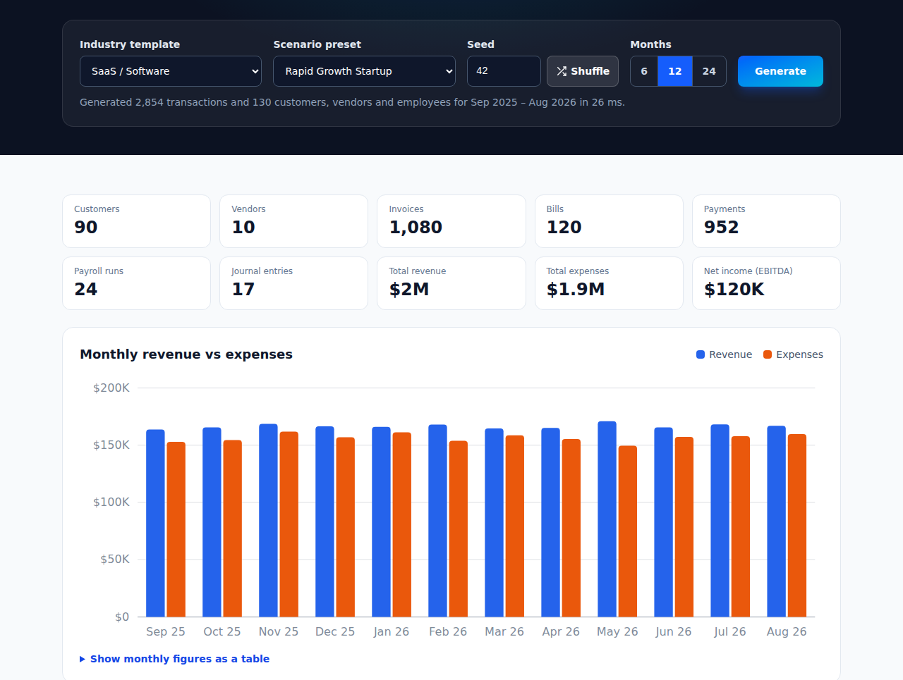

<div align="center">

# EasyTestData

**Realistic test data for QuickBooks Online sandboxes.**

Fill a QuickBooks Online (QBO) sandbox with a year of financially coherent books (customers,
invoices, bills, payments, payroll, journal entries) and purge it cleanly when you're done.

[](https://github.com/easytestdata/easytestdata/actions/workflows/ci.yml)
[](https://www.npmjs.com/package/easytestdata)
[](LICENSE)

[**Try it in your browser**](https://easytestdata.com/playground) ·
[Run it locally](docs/run-locally.md) ·
[EasyTestData Cloud (free)](https://app.easytestdata.com) ·
[Examples](examples)



</div>

## Why

QBO sandbox companies start almost empty, and hand-entering invoices doesn't scale. Random fake
data is worse: payments that don't match invoices, expenses that don't fit the chart of accounts,
and reports that make no sense.

EasyTestData generates books that behave like a real business:

- **Financially coherent.** Invoices tie to payments, bills to bill payments, and revenue and
  target profit hit the numbers you set.
- **Industry-specific.** 8 industry templates with their own service items, expense categories,
  and ratios, and 8 scenarios from a quick three-month demo to a fast-growing company and messy
  books full of credits and refunds.
- **Realistic.** Locale-aware company names, contacts, and addresses, plus the messy parts:
  partial payments, credit memos, refunds, and overdue receivables.
- **Deterministic.** The same seed and dates produce byte-identical data, so tests and bug
  reports are reproducible.
- **Safe.** Sandbox-only by design: the client
  [refuses any host but the sandbox API](packages/qbo-client/src/qbo-client.js). Every
  generated record is tagged, so `easytestdata purge` deletes the transactions it added, makes
  its customers, vendors, employees and items inactive (accounts stay), and never touches
  records you made by hand ([details](https://easytestdata.com/faq#purge)).

## Quick start

The web app on your own computer, with no account, no sign-in and nothing else to install
(Node.js 22.13+):

```bash
npx easytestdata ui
```

It opens `http://localhost:28080`: pick an industry and a scenario, then download the books as
files or load them into a QBO sandbox (the first time you connect one, a setup screen asks for
your Intuit developer app's keys). Your data stays in `~/.easytestdata`. See
[docs/run-locally.md](docs/run-locally.md).

Prefer not to install anything? [EasyTestData Cloud](https://app.easytestdata.com) is the same
app, hosted and free: sign in with Google, GitHub or Intuit and connect a sandbox, with no keys to
copy.

### The CLI

Generating files needs no account. Loading into a sandbox needs a free Intuit developer account
and sandbox company (see below). Generate a year of books as CSV:

```bash
# Node.js 22.13+
npx easytestdata generate --template saas --scenario rapid-growth --seed 42 \
  --start-date 2025-09-01 --format csv --output ./sample-data
```

```text
Wrote 22 CSV files to ./sample-data/

EasyTestData plan: saas template · rapid-growth scenario · seed 42 · US · tag EZTD
Period 2025-09-01 to 2026-08-31 (12 months)

  Customers           90      Bills              120
  Vendors             10      Bill payments      102
  Employees           30      Vendor credits       1
  Invoices         1,080      Purchase orders      4
  Payments           952      Expenses            48
  Sales receipts     132      Payroll runs        24
  Credit memos        58      Deposits            89
  Refund receipts      4      Transfers           18
  Estimates          205      Journal entries     17

  Total revenue   $2,000,000.00
  Total expenses  $1,880,000.00
  Target profit     $120,000.00
  Target profit is before credits, refunds and adjustments; QuickBooks' P&L will differ.
```

Then load the same books into a QBO sandbox, and clear them when you're done:

1. Sign up at [developer.intuit.com](https://developer.intuit.com) (free). A sandbox company is
   created for you, and you create an app with the Accounting scope.
2. In the app's **Development** keys, add `http://localhost:8085/callback` to the redirect URIs
   and note the Client ID and Secret.
3. Connect, load, clear:

```bash
npx easytestdata auth --client-id <id> --client-secret <secret>   # one time, opens your browser
npx easytestdata load --template saas --scenario rapid-growth --seed 42 --start-date 2025-09-01
npx easytestdata purge --mode generated
```

The [CLI guide](packages/cli#load-into-a-qbo-sandbox) walks through it in a few minutes.

## Four ways to use it

| Option                                                                       | Best for                                                                   |
| ---------------------------------------------------------------------------- | -------------------------------------------------------------------------- |
| **[Playground](https://easytestdata.com/playground)** (in your browser)      | Previewing and downloading a dataset, no install and no account            |
| **[CLI](packages/cli)** (`npx easytestdata`) or **[library](packages/core)** | Developers, CI pipelines, test fixtures                                    |
| **[Web app on your computer](docs/run-locally.md)** (`npx easytestdata ui`)  | The web app with no account and no limits, using your own Intuit app       |
| **[EasyTestData Cloud](https://app.easytestdata.com)** (free)                | The web app without running anything, with teams; connect a sandbox and go |

All four run the same Apache-2.0 code. The web app adds a guided wizard, job progress,
downloads and rollback; Cloud adds teams. Whichever you pick, only QBO sandbox companies can be
connected: Intuit development keys can't authorize
production companies, and the QBO client refuses any host but the sandbox API.

### Library

```bash
npm install @easytestdata/core
```

```js
import { generate, exportToCsv } from "@easytestdata/core";

const plan = generate({
  template: "saas",
  preset: "rapid-growth",
  seed: 42,
  startDate: "2025-09-01"
});
console.log(plan.customers[0].name, plan.invoices.length); // "Nguyen Media" 1080
const tables = exportToCsv(plan); // { customers, invoices, invoice_lines, ... }
```

More in [`examples/`](examples): deterministic test fixtures, custom scenarios, a GitHub Actions
workflow that seeds a sandbox before integration tests.

## Industry templates and scenarios

`easytestdata templates` and `easytestdata scenarios` list the ids below (a scenario is the
`--scenario` flag on the CLI), and `--inspect <id>` shows the details.

| Template                | Description                                                                            |
| ----------------------- | -------------------------------------------------------------------------------------- |
| `professional-services` | Consulting firms, agencies, law practices. 92% invoiced, 8% cash. Default template.    |
| `saas`                  | Software-as-a-service companies. Subscription and usage revenue, 95% invoiced.         |
| `restaurant`            | Restaurants and food service. 85% cash sales, 32% of spend on food and ingredients.    |
| `construction`          | General contractors. Estimates on 80% of jobs, purchase orders, 30-90 day collections. |
| `retail`                | Brick-and-mortar and e-commerce stores. 80% cash sales, 45% cost of goods.             |
| `healthcare`            | Medical practices and clinics. Patient and lab services, 30-90 day payment delays.     |
| `nonprofit`             | Charitable organizations. Donations, grants, program fees, and program expenses.       |
| `real-estate`           | Property management. Rent, management fees, and late fees; 85% invoiced.               |

| Scenario          | What you get                                                        |
| ----------------- | ------------------------------------------------------------------- |
| `quick-demo`      | Quick demo: a small company over 3 months, for a fast first load.   |
| `healthy-small`   | Healthy small business with steady margins.                         |
| `cash-crisis`     | Cash-flow crunch: slow-paying customers and thin margins.           |
| `rapid-growth`    | Fast-growing company with aggressive hiring and reinvestment.       |
| `seasonal`        | Seasonal business with larger quarter-end movement.                 |
| `mature-stable`   | Steady, established company with high collection rates.             |
| `audit-nightmare` | Messy books: credits, refunds and adjustments, delayed settlements. |
| `new-company`     | Brand-new company with low volume and few vendors.                  |

Your industry isn't here? Templates and scenarios are the easiest way to contribute: see
[docs/contributing-templates.md](docs/contributing-templates.md).

## Repository layout

| Path                                                         | What it is                                                           |
| ------------------------------------------------------------ | -------------------------------------------------------------------- |
| [`packages/core`](packages/core)                             | The generation engine. Zero dependencies, runs in Node and browsers. |
| [`packages/qbo-client`](packages/qbo-client)                 | QBO API client: OAuth, rate limiting, batching, load, and purge.     |
| [`packages/cli`](packages/cli)                               | The `easytestdata` CLI, including `easytestdata ui`.                 |
| [`packages/server`](packages/server)                         | API server and job runner for the web app, Cloud and local.          |
| [`packages/web`](packages/web), [`packages/ui`](packages/ui) | The web app and its shared React components.                         |
| [`packages/shared`](packages/shared)                         | Zod schemas and constants shared by the server and web app.          |
| [`packages/marketing`](packages/marketing)                   | easytestdata.com, including the in-browser playground.               |
| [`examples`](examples)                                       | Runnable examples, checked in CI.                                    |

See [docs/architecture.md](docs/architecture.md) for how the pieces fit together.

## Development

Develop on Node.js 24 (`.nvmrc`; 22.13+ also works) and pnpm 9. No database server, Docker or
`.env` needed.

```bash
pnpm install
pnpm run test             # all tests
pnpm run lint && pnpm run format:check
pnpm run dev              # the server in local mode (embedded database) and the web app, in
                          # watch mode: open http://localhost:5173
```

See [CONTRIBUTING.md](CONTRIBUTING.md) for the full setup.

## Contributing

Contributions are welcome. New industry templates and scenarios are the best first
contributions. Start with [CONTRIBUTING.md](CONTRIBUTING.md), look
for [good first issues](https://github.com/easytestdata/easytestdata/labels/good%20first%20issue),
or ask in [Discussions](https://github.com/easytestdata/easytestdata/discussions). Please follow
the [Code of Conduct](CODE_OF_CONDUCT.md) and report security issues privately as described in
[SECURITY.md](SECURITY.md).

Releases are described in [docs/releasing.md](docs/releasing.md).

## License

[Apache-2.0](LICENSE) for everything in this repository, including the server and web app that
run EasyTestData Cloud and `easytestdata ui`. See [NOTICE](NOTICE) for attributions.

QuickBooks is a registered trademark of Intuit Inc. EasyTestData is not affiliated with or
endorsed by Intuit.
